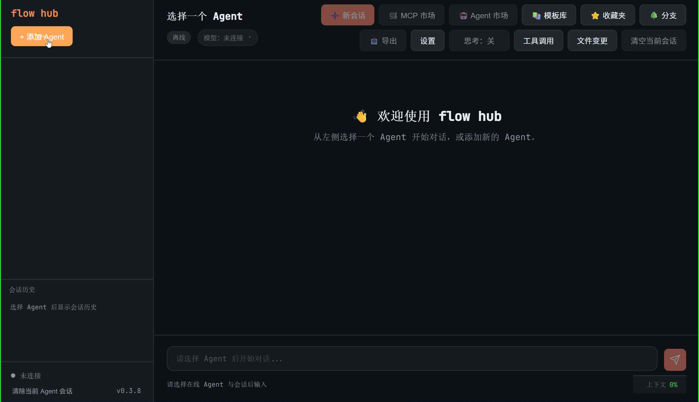
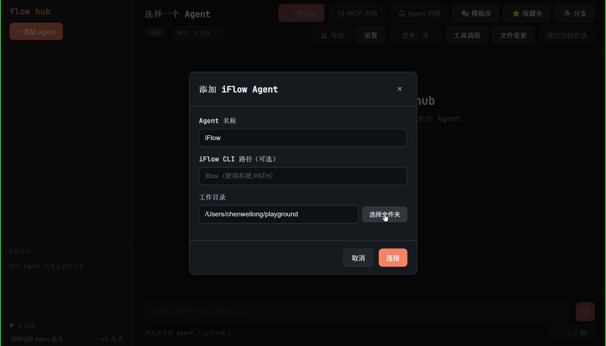
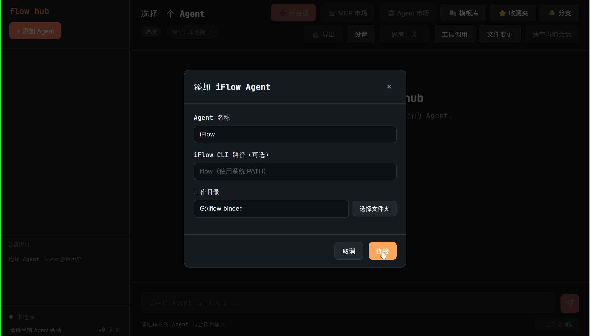
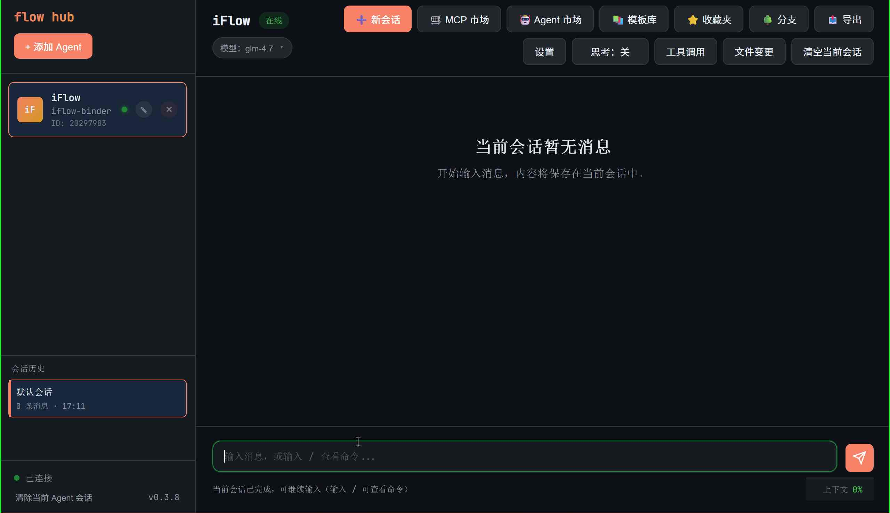
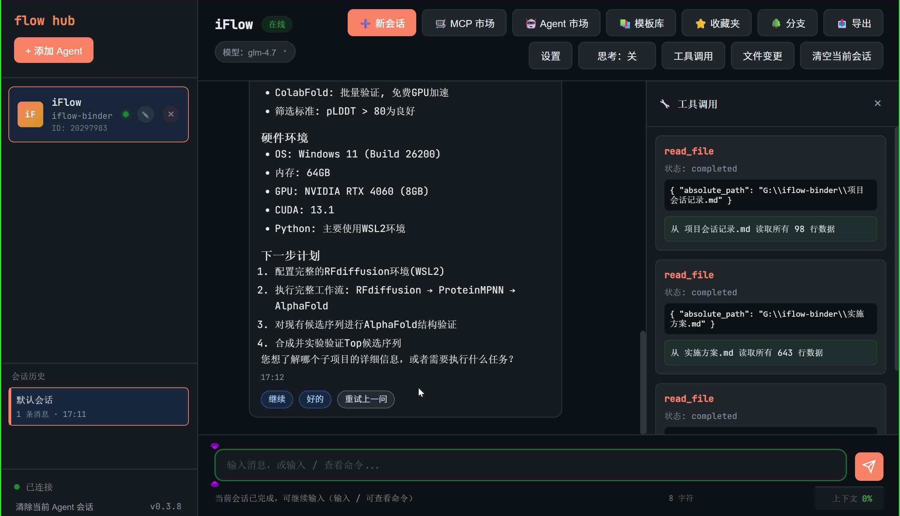

<div align="center">


# FlowHub

[](https://tauri.app/)
[](https://www.typescriptlang.org/)
[](https://www.rust-lang.org/)
[](LICENSE)
[](package.json)

**一个功能强大的多 Agent 桌面工作台，专注于 iFlow ACP 协议接入、历史会话管理与可视化交互**

[English](#english-documentation) | [简体中文](#简体中文文档)

</div>

---

## 简体中文文档

> FlowHub 是一个基于 Tauri 2.0 构建的现代化多 Agent 桌面应用，提供直观的图形界面来管理 iFlow CLI 的多智能体协作、会话历史、工具调用等功能，让 AI 辅助开发变得更加高效便捷。

---

### ✨ 特性

- 🎯 **多 Agent 管理** - 轻松添加、重连、重命名、删除多个 iFlow Agent，支持独立配置
- 🤖 **模型管理** - 实时查看当前模型、拉取可用模型列表、一键切换模型
- 💬 **会话管理** - 多会话支持、自动标题生成、会话持久化存储
- 📜 **历史导入** - 自动导入 iFlow 历史会话，支持按工作目录读取
- 🎨 **优雅界面** - Markdown 渲染（表格、代码块、链接、图片）、思考块显示
- 🔧 **工具调用面板** - 实时追踪工具调用状态、参数和输出
- 📝 **文件变更面板** - 手动查看 Git 变更，支持 Diff 预览
- 🌐 **HTML Artifact 预览** - 弹窗预览 HTML 输出，支持中文文件名
- ⚙️ **设置中心** - 集中管理重连策略、提示音、主题、权限模式等
- 🛒 **MCP 市场** - 集成 MCP 工具市场（当前版本需通过 iFlow CLI 交互）
- 🤖 **Agent 市场** - 集成 Agent 市场（当前版本需通过 iFlow CLI 交互）
- 📚 **Prompt 模板库** - 内置 30+ 模板，支持自定义添加和管理
- ⭐ **收藏夹系统** - 快速收藏重要对话和消息
- 🌳 **对话分支** - 支持对话分支管理
- 📤 **会话导出** - 支持 Markdown、HTML、JSON、TXT 格式导出
- 🎨 **主题系统** - 支持系统主题跟随、亮色/暗色主题、自定义强调色
- ⌨️ **命令面板** - Ctrl+Shift+P 快速打开命令面板
- 🎯 **快捷回复** - 一键发送"继续"、"好的"、重试上一问

---

### 📸 截图

<div align="center">






</div>

---

### 🚀 快速开始

#### 前置要求

Node.js 22+
Rust 1.70+（通过 rustup 安装）

### iFlow CLI：

# 快速启动Agent代理
```bash
bash -c "$(curl -fsSL https://gitee.com/iflow-ai/iflow-cli/raw/main/install.sh)"
```


# 已安装Node.js 22+
```shell
npm i -g @iflow-ai/iflow-cli@latest
```


Windows

1. Visit https://nodejs.org/en/download to download the latest Node.js installer
2. Run the installer to install Node.js
3. Restart terminal: CMD (Windows + R, type cmd) or PowerShell
4. Run `npm install -g @iflow-ai/iflow-cli@latest` to install iFlow CLI
5. Run `iflow` to start iFlow CLI

克隆项目并安装依赖：

```bash
# 克隆项目
git clone https://github.com/Nikolahuang/iflowhub-desktop.git
cd iflowhub-desktop

# 安装依赖
npm install
```

#### 启动应用

```bash
# 启动开发模式
npm run tauri:dev
```

应用将在开发模式下启动，前端运行在 `http://localhost:1420/`

#### 仅启动前端（开发调试）

```bash
# 仅启动前端开发服务器
npm run dev
```

#### 构建生产版本

```bash
# 构建生产版本
npm run tauri:build
```

构建完成后，安装包将位于 `src-tauri/target/release/bundle/` 目录。

---

### 📖 功能详解

#### Agent 管理

- **添加 Agent**：点击左上角 "+ 添加 Agent" 按钮，配置工作区路径和 iFlow 路径
- **重连 Agent**：Agent 断线后点击重连按钮恢复连接
- **重命名 Agent**：点击编辑图标修改 Agent 名称
- **删除 Agent**：点击删除图标移除 Agent 及其所有数据

#### 会话管理

- **创建新会话**：点击"➕ 新会话"按钮开始新对话
- **切换会话**：从左侧会话列表选择历史会话
- **重命名会话**：右键点击会话可重命名
- **删除会话**：删除会话将同时删除对应的历史文件

#### 工具调用面板

- **自动追踪**：自动显示当前会话的所有工具调用
- **状态监控**：实时显示每个工具调用的状态（运行中/完成/错误）
- **参数查看**：展开查看工具调用的输入参数
- **输出查看**：查看工具调用的返回结果

#### 文件变更面板

- **手动刷新**：点击"文件变更"按钮打开面板，点击刷新按钮获取最新变更
- **Diff 预览**：点击任意文件查看详细的差异对比
- **状态标记**：清晰显示文件的暂存/未暂存状态

#### 设置中心

- **刷新后重连**：配置应用刷新后的重连策略（最后一个/全部/关闭）
- **提示音**：从 8 个内置铃声中选择，或上传自定义提示音
- **主题切换**：支持系统主题、亮色主题、暗色主题
- **权限模式**：配置 YOLO/智能/确认三种权限模式
- **消息超时**：配置消息生成超时时间

---

### 🛠️ 技术栈

**前端**
- TypeScript 5.0+
- Vite 5.0+
- CSS3（现代 CSS 特性）

**后端**
- Rust 1.70+
- Tauri 2.0
- Tokio（异步运行时）
- tokio-tungstenite（WebSocket）

**通信协议**
- WebSocket
- JSON-RPC
- ACP (Agent Communication Protocol)

---

### 📁 项目结构

```text
FlowHub/
├── src/                      # 前端源码
│   ├── main.ts              # 应用入口
│   ├── types.ts             # 类型定义
│   ├── store.ts             # 应用状态管理
│   ├── config.ts            # 运行时配置
│   ├── dom.ts               # DOM 元素引用
│   ├── styles.css           # 全局样式
│   ├── services/            # 服务层
│   │   ├── tauri.ts         # Tauri IPC 封装
│   │   └── events.ts        # 事件监听封装
│   ├── features/            # 功能模块
│   │   ├── agents/          # Agent 管理
│   │   ├── sessions/        # 会话管理
│   │   ├── storage/         # 存储功能
│   │   ├── ui/              # UI 组件
│   │   ├── app.ts           # 应用核心
│   │   ├── templates.ts     # Prompt 模板库
│   │   ├── favorites.ts     # 收藏夹
│   │   ├── branch.ts        # 对话分支
│   │   ├── command-palette.ts # 命令面板
│   │   ├── shortcuts.ts     # 快捷键
│   │   ├── enhancements.ts  # 增强功能
│   │   ├── export.ts        # 导出功能
│   │   ├── memory.ts        # 记忆管理
│   │   ├── clipboard.ts     # 剪贴板
│   │   ├── quickcommands.ts # 快捷命令
│   │   └── market.ts        # MCP 和 Agent 市场
│   └── lib/                 # 工具库
│       ├── html.ts          # HTML 工具
│       ├── markdown.ts      # Markdown 渲染
│       └── utils.ts         # 通用工具函数
├── src-tauri/               # Rust 后端
│   ├── src/
│   │   ├── main.rs         # Tauri 入口
│   │   ├── state.rs        # 应用状态
│   │   ├── manager.rs      # Agent 生命周期管理
│   │   ├── models.rs       # 数据模型
│   │   ├── commands.rs     # Tauri 命令处理
│   │   ├── storage.rs      # 文件存储
│   │   ├── router.rs       # 事件路由
│   │   ├── history.rs      # iFlow 历史读取
│   │   ├── artifact.rs     # HTML Artifact
│   │   ├── model_resolver.rs # 模型解析
│   │   ├── git.rs          # Git 操作
│   │   ├── dialog.rs       # 文件选择对话框
│   │   ├── runtime_env.rs  # 运行时环境
│   │   └── agents/         # Agent 相关
│   │       ├── iflow_adapter.rs  # ACP 协议适配
│   │       └── session_params.rs # 会话参数构建
│   ├── Cargo.toml          # Rust 依赖
│   └── tauri.conf.json     # Tauri 配置
├── public/                  # 静态资源
│   └── audio/              # 提示音
├── index.html               # HTML 入口
├── package.json            # NPM 配置
├── tsconfig.json           # TypeScript 配置
├── vite.config.ts          # Vite 配置
├── CHANGELOG.md            # 变更日志
├── LICENSE                 # MIT 许可证
└── README.md              # 项目说明

```

---

### 🔧 构建与发布

#### 开发构建

```bash
npm run tauri:dev
```

#### 生产构建

```bash
npm run tauri:build
```

构建产物将输出到 `src-tauri/target/release/` 目录

#### 检查代码

```bash
# TypeScript 类型检查
npm run build

# Rust 类型检查
cd src-tauri
cargo check
```

---

### 🤝 贡献指南

我们欢迎任何形式的贡献！请遵循以下步骤：

1. Fork 本仓库
2. 创建特性分支 (`git checkout -b feature/AmazingFeature`)
3. 提交更改 (`git commit -m 'Add some AmazingFeature'`)
4. 推送到分支 (`git push origin feature/AmazingFeature`)
5. 提交 Pull Request

#### 代码规范

- 遵循现有代码风格
- 使用 TypeScript 的严格模式
- Rust 代码使用 `cargo fmt` 和 `cargo clippy` 检查
- 提交前确保所有测试通过

---

### 📝 更新日志

查看 [CHANGELOG.md](CHANGELOG.md) 了解详细的版本更新历史。

---

### 🐛 问题反馈

如果您发现了 bug 或有功能建议，请在 [Issues](https://github.com/yourusername/FlowHub/issues) 中提交。

---

### 📄 许可证

本项目采用 MIT 许可证 - 详见 [LICENSE](LICENSE) 文件

---

### 🙏 致谢

- [Tauri](https://tauri.app/) - 强大的跨平台桌面应用框架
- [iFlow CLI](https://cli.iflow.cn/) - 强大的命令行 AI 助手
- [Rust](https://www.rust-lang.org/) - 系统编程语言
- [TypeScript](https://www.typescriptlang.org/) - JavaScript 的超集
- [chenweil](https://github.com/chenweil/FlowHub)  - 原创作者

---

### 📮 联系方式

- 项目主页：[https://github.com/Nikolahuang/FlowHub](https://github.com/Nikolahuang/iflowhub-desktop)
- 问题反馈：[Issues](https://github.com/Nikolahuang/iflowhub-desktop/issues)

---

### ⭐ Star History

如果这个项目对你有帮助，请给它一个 Star！

<div align="center">
  <sub>Made with ❤️ by FlowHub Team</sub>
</div>

---

## English Documentation

<div align="center">

**FlowHub**

**A powerful multi-Agent desktop workstation focused on iFlow ACP protocol integration, history session management and visual interaction**

[简体中文](#简体中文文档) | [English](#english-documentation)

</div>

---

### ✨ Features

- 🎯 **Multi-Agent Management** - Easily add, reconnect, rename, and delete multiple iFlow Agents with independent configurations
- 🤖 **Model Management** - Real-time view current model, fetch available model list, one-click model switching
- 💬 **Session Management** - Multi-session support, automatic title generation, persistent session storage
- 📜 **History Import** - Automatically import iFlow history sessions by workspace directory
- 🎨 **Elegant Interface** - Markdown rendering (tables, code blocks, links, images), thought blocks display
- 🔧 **Tool Call Panel** - Real-time tracking of tool call status, parameters and output
- 📝 **File Change Panel** - Manually view Git changes with Diff preview
- 🌐 **HTML Artifact Preview** - Popup preview of HTML output with Chinese filename support
- ⚙️ **Settings Center** - Centralized management of reconnection strategy, notification sounds, themes, permission modes, etc.
- 🛒 **MCP Market** - Integrated MCP tool market (current version requires iFlow CLI interaction)
- 🤖 **Agent Market** - Integrated Agent market (current version requires iFlow CLI interaction)
- 📚 **Prompt Template Library** - 30+ built-in templates, support for custom addition and management
- ⭐ **Favorites System** - Quickly bookmark important conversations and messages
- 🌳 **Conversation Branching** - Support for conversation branch management
- 📤 **Session Export** - Support for Markdown, HTML, JSON, TXT format export
- 🎨 **Theme System** - Support for system theme following, light/dark themes, custom accent colors
- ⌨️ **Command Palette** - Quick access with Ctrl+Shift+P
- 🎯 **Quick Replies** - One-click send "Continue", "OK", retry last question

---

### 🚀 Quick Start

#### Prerequisites

- **Node.js** 22+
- **Rust** 1.70+ (installed via rustup)
- **iFlow CLI** - Download and install from [iFlow CLI](https://cli.iflow.cn/)

#### Installation

```bash
git clone https://github.com/yourusername/FlowHub.git
cd FlowHub
npm install
```

#### Start Application

```bash
npm run tauri:dev
```

The application will start in development mode with the frontend running on `http://localhost:1420/`

#### Frontend Only (Development)

```bash
npm run dev
```

---

### 📖 Feature Details

#### Agent Management

- **Add Agent**: Click the "+ Add Agent" button in the top-left corner to configure workspace path and iFlow path
- **Reconnect Agent**: Click the reconnect button to restore connection when Agent is disconnected
- **Rename Agent**: Click the edit icon to modify Agent name
- **Delete Agent**: Click the delete icon to remove the Agent and all its data

#### Session Management

- **Create New Session**: Click the "➕ New Session" button to start a new conversation
- **Switch Session**: Select a historical session from the session list on the left
- **Rename Session**: Right-click on a session to rename it
- **Delete Session**: Deleting a session will also delete the corresponding history file

#### Tool Call Panel

- **Auto Tracking**: Automatically displays all tool calls for the current session
- **Status Monitoring**: Real-time display of each tool call's status (running/completed/error)
- **Parameter View**: Expand to view tool call input parameters
- **Output View**: View tool call return results

#### File Change Panel

- **Manual Refresh**: Click the "File Changes" button to open the panel, click the refresh button to get the latest changes
- **Diff Preview**: Click any file to view detailed differences
- **Status Marking**: Clearly displays staged/unstaged file status

#### Settings Center

- **Reconnect on Refresh**: Configure reconnection strategy after app refresh (last/all/off)
- **Notification Sound**: Choose from 8 built-in ringtones or upload custom notification sounds
- **Theme Switching**: Support for system theme, light theme, dark theme
- **Permission Mode**: Configure YOLO/smart/confirm three permission modes
- **Message Timeout**: Configure message generation timeout

---

### 🛠️ Tech Stack

**Frontend**
- TypeScript 5.0+
- Vite 5.0+
- CSS3 (Modern CSS Features)

**Backend**
- Rust 1.70+
- Tauri 2.0
- Tokio (Async Runtime)
- tokio-tungstenite (WebSocket)

**Communication Protocol**
- WebSocket
- JSON-RPC
- ACP (Agent Communication Protocol)

---

### 📁 Project Structure

```text
FlowHub/
├── src/                      # Frontend source code
│   ├── main.ts              # Application entry
│   ├── types.ts             # Type definitions
│   ├── store.ts             # Application state management
│   ├── config.ts            # Runtime configuration
│   ├── dom.ts               # DOM element references
│   ├── styles.css           # Global styles
│   ├── services/            # Service layer
│   │   ├── tauri.ts         # Tauri IPC wrapper
│   │   └── events.ts        # Event listener wrapper
│   ├── features/            # Feature modules
│   │   ├── agents/          # Agent management
│   │   ├── sessions/        # Session management
│   │   ├── storage/         # Storage features
│   │   ├── ui/              # UI components
│   │   ├── app.ts           # Application core
│   │   ├── templates.ts     # Prompt template library
│   │   ├── favorites.ts     # Favorites
│   │   ├── branch.ts        # Conversation branching
│   │   ├── command-palette.ts # Command palette
│   │   ├── shortcuts.ts     # Keyboard shortcuts
│   │   ├── enhancements.ts  # Enhancement features
│   │   ├── export.ts        # Export features
│   │   ├── memory.ts        # Memory management
│   │   ├── clipboard.ts     # Clipboard
│   │   ├── quickcommands.ts # Quick commands
│   │   └── market.ts        # MCP and Agent market
│   └── lib/                 # Utility library
│       ├── html.ts          # HTML utilities
│       ├── markdown.ts      # Markdown rendering
│       └── utils.ts         # Common utilities
├── src-tauri/               # Rust backend
│   ├── src/
│   │   ├── main.rs         # Tauri entry point
│   │   ├── state.rs        # Application state
│   │   ├── manager.rs      # Agent lifecycle management
│   │   ├── models.rs       # Data models
│   │   ├── commands.rs     # Tauri command handling
│   │   ├── storage.rs      # File storage
│   │   ├── router.rs       # Event routing
│   │   ├── history.rs      # iFlow history reading
│   │   ├── artifact.rs     # HTML Artifact
│   │   ├── model_resolver.rs # Model resolution
│   │   ├── git.rs          # Git operations
│   │   ├── dialog.rs       # File selection dialog
│   │   ├── runtime_env.rs  # Runtime environment
│   │   └── agents/         # Agent related
│   │       ├── iflow_adapter.rs  # ACP protocol adapter
│   │       └── session_params.rs # Session parameter construction
│   ├── Cargo.toml          # Rust dependencies
│   └── tauri.conf.json     # Tauri configuration
├── public/                  # Static resources
│   └── audio/              # Notification sounds
├── index.html               # HTML entry point
├── package.json            # NPM configuration
├── tsconfig.json           # TypeScript configuration
├── vite.config.ts          # Vite configuration
├── CHANGELOG.md            # Changelog
├── LICENSE                 # MIT License
└── README.md              # Project documentation

```

---

### 🔧 Build & Release

#### Development Build

```bash
npm run tauri:dev
```

#### Production Build

```bash
npm run tauri:build
```

Build artifacts will be output to the `src-tauri/target/release/` directory

#### Code Check

```bash
# TypeScript type checking
npm run build

# Rust type checking
cd src-tauri
cargo check
```

---

### 🤝 Contributing

We welcome any form of contribution! Please follow these steps:

1. Fork this repository
2. Create your feature branch (`git checkout -b feature/AmazingFeature`)
3. Commit your changes (`git commit -m 'Add some AmazingFeature'`)
4. Push to the branch (`git push origin feature/AmazingFeature`)
5. Open a Pull Request

#### Code Style

- Follow existing code style
- Use TypeScript strict mode
- Use `cargo fmt` and `cargo clippy` for Rust code
- Ensure all tests pass before submitting

---

### 📝 Changelog

See [CHANGELOG.md](CHANGELOG.md) for detailed version update history.

---

### 🐛 Bug Reports

If you find a bug or have a feature suggestion, please submit it in [Issues](https://github.com/yourusername/FlowHub/issues).

---

### 📄 License

This project is licensed under the MIT License - see the [LICENSE](LICENSE) file for details

---

### 🙏 Acknowledgments

- [Tauri](https://tauri.app/) - Powerful cross-platform desktop application framework
- [iFlow CLI](https://cli.iflow.cn/) - Powerful command-line AI assistant
- [Rust](https://www.rust-lang.org/) - Systems programming language
- [TypeScript](https://www.typescriptlang.org/) - A superset of JavaScript

---

### 📮 Contact

- Project Homepage: [https://github.com/Nikolahuang/FlowHub](https://github.com/Nikolahuang/iflowhub-desktop)
- Issue Tracker: [Issues](https://github.com/Nikolahuang/iflowhub-desktop/issues)

---

### ⭐ Star History

If this project helps you, please give it a Star!

<div align="center">
  <sub>Made with ❤️ by FlowHub Team</sub>
</div>